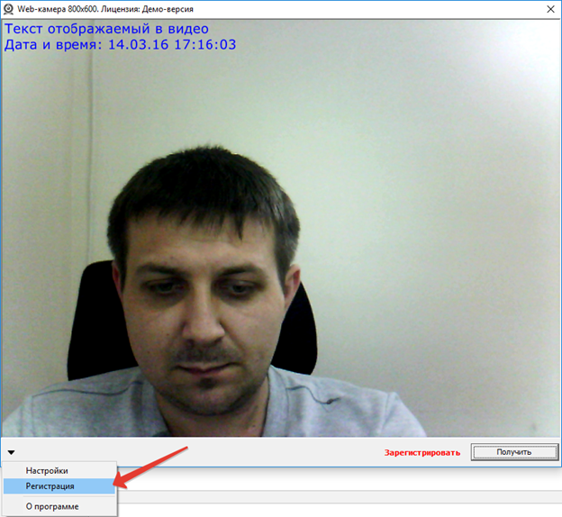
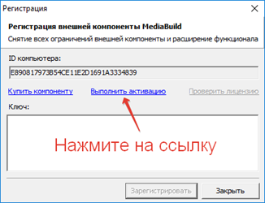
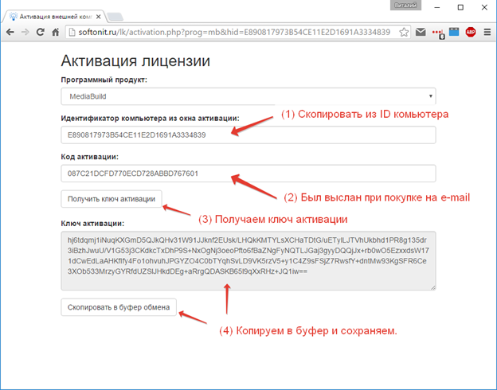
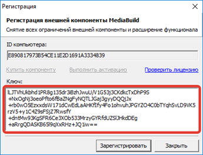

# Способ 1. Активируем из 1С

## Шаг 1.
Получение ключа активации используя полученный код активации и идентификатор компьютера из окна активации.  
Это можно сделать несколькими способами:  
Вызывать программно форму фотографирования и в левом нижнем углу в открывшейся форме в подменю нажать `Регистрация`. 

Вот как это выглядит:

## Шаг 2. 
После нажатия откроется вот это окно:

## Шаг 3.
!!! light
Обратите внимание указан `ID` компьютера. Он будет разным для каждого из компьютеров, где будет активация.
!!!  
После нажатия на ссылку `Выполнить активацию` откроется сайт, где необходимо активировать решение.  
На сайте необходимо авторизоваться под вашей учетной записью, если ее нет, то зарегистрироваться. 

После авторизации будет доступна следующая форма:

## Шаг 4. 
После копирования необходимо вставить обратно в программу и нажать `Зарегистрировать`.

## Шаг 5. 
Перезапустите конфигурацию для того, чтобы закончить процесс активации.  
!!! warning Обратите внимание! 
В конфигурации должна присутствовать обработка событий (**процедура ВнешнееСобытие**) как в демо-версии у основной формы обработки `МediaBuild_Демонстрация`. Каждый такой ключ сохраняется отдельно в регистр сведений с настройками и присваивается на том компьютере, где был активирован при загрузке настроек ВК. Для каждого компьютера, где происходит активация ключ разный!
!!!
