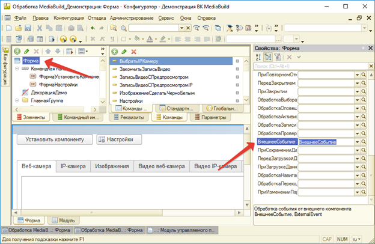

# События из внешней компоненты в 1С

Во время работы во внешней компоненте могут срабатывать определенные события, которые не зависят от 1С.  
Обработка таких событий осуществляется на стороне 1С в предопределенной процедуре формы или модуля приложения.   
* **В первом параметре** процедуры передается параметр `Источник`, он всегда равен: `MediaBuild` и говорит о том, что событие пришло от ВК.   
* **Вторым параметром** идет тип события `Событие[Число]` (тип Строка обязателен), которые отвечает на вопрос, а что это за событие и от какой камеры оно пришло.  
* **И, наконец, третьим параметром** идет параметр `Данные` (тип Строка не обязателен). Он хранит данные, которые может передать ВК.


Для того, чтобы можно было принимать события от ВК в открытой форме определите встроенное событие формы ВнешнееСобытие:



А вот описание процедуры:
``` bsl
&НаКлиенте
Процедура ВнешнееСобытие(Источник, СобытиеИКамера, Данные)
	
  // Обработка событие от внешней компоненты MediaBuild
  Если Источник = "MediaBuild" Тогда

    Событие = Лев(СобытиеИКамера, Найти(СобытиеИКамера, "[") - 1); // Что за событие
    НомерКамерыСобытия = Число(Сред(СобытиеИКамера, Найти(СобытиеИКамера, "[") + 1,
      Найти(СобытиеИКамера, "]") - Найти(СобытиеИКамера, "[") - 1)); // От какой камеры

    Если Событие = "Activation" Тогда

      // Программа активирована надо записать "Данные" и 
      // присвоить ВК

    ИначеЕсли Событие = "Frame" Тогда

      // Получен кадр из ВК созданный методом GetFrames	

    ИначеЕсли Событие = "Error" Тогда

      // Сообщение об ошибке

    ИначеЕсли Событие = "DiskFull" Тогда

      // Тут можно остановить запись и присвоить новый ПутьКХранилищу для записи видео

    ИначеЕсли Событие = "…" Тогда

      …

    КонецЕсли;

  КонецЕсли; 

КонецПроцедуры
```
Опишем все события, которые возникают.